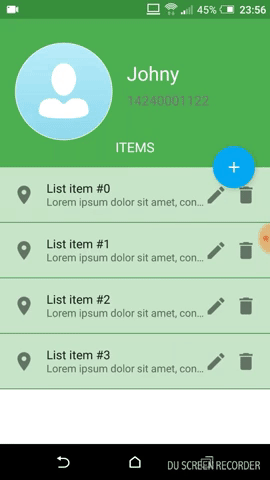

# collapsing-toolbar

This application shows an example solution of the common Android developer's problem: combining a `CoordinatorLayout`, `CollapsingTollbarLayout` and a `RecyclerView`. 

The intended behaviour is to let the `RecyclerView` scroll only if its items are not visible on the screen, otherwise block both `CollapsingTollbarLayout` and `RecyclerView`.

The application also demonstrates the [CircleImageView](https://github.com/hdodenhof/CircleImageView) collapsing within the toolbar.

